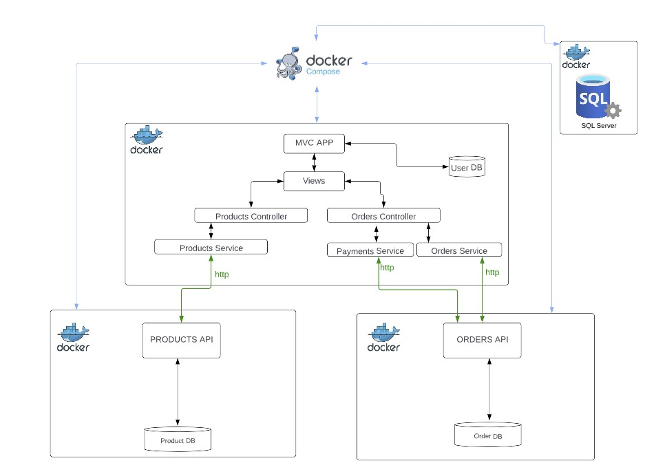

# IrishNFTs

## Introduction
Welcome to the IrishNFTs documentation. IrishNFTs was developed as a sample web application for buying and selling NFTs of original art-pieces. The user can browse for and purhchase one of the pieces for sale. Because the pieces for sale are unique, they will no longer be available once the user has purchased an NFT. If a user cancels their order, the at piece will show again as available. Admin features have also been enabled, allowing management of the content of the site via the admin account.
<br>
Developed initially for a college assignment, the project's intention was to focus on micro-services and to learn concepts relating to API development and the .NET framework. The project was developed using .NET 7, Bootstrap and jQuery. 
<br>

### Technologies

- .NET 7 (MVC and Web API)
- Bootstrap
- jQuery
- Docker
<br>

### Architecture

Please see the below diagram that illustrates the overall architecture of the application. This highlights how each part of the application is linked via docker compose



### .NET packages used

<br>

> **Note:** Because Docker containers are being used, you won't need to install any of these packages locally. The below is just to illustrate what has been installed in the MVC App, Projects API and Orders API at this stage of development. You will see these as package references in each of the components' csproj files.

<br>

 - Microsoft.AspNetCore.Identity.EntityFrameworkCore (MVC only)
 - Microsoft.AspNetCore.Identity.UI (MVC only)
 - Microsoft.EntityFrameworkCore
 - Microsoft.EntityFrameworkCore.Design
 - Microsoft.EntityFrameworkCore.SqlServer
 - Microsoft.EntityFrameworkCore.Tools
 - Microsoft.VisualStudio.Web.CodeGeneration.Design
<br>

### Components

<br>
- Frontend MVC app with Products, Orders, and Payments controllers
- Backend: Products, Orders, and Payments services for handling transactions
- OrdersAPI and ProductsAPI
- SQL Server

All of these components run in separate Docker containers, as per the previous diagram.
 
 
<br>

## Setup and Prerequisites

> **Note** - As it stands this application has been tested as working on a Windows 11 machine and a Linux Ubuntu machine. I do not currently have access to a MAC OS machine to test. Given that the application is running on both Windows and Ubuntu, it should work similarly on Apple. It's possible there are configuration or troubleshooting requirements that I'm unaware of at present.

<br>
- Internet Access
- A host machine to run the application (Windows, Linux, MacOS)
- Docker desktop installed

For the app to run you will need to follow these steps:

1. Ensure that Docker Desktop is installed on your host machine. 

   - [Windows Installation Guide](https://docs.docker.com/desktop/install/windows-install/)
   - [Linux Installation Guide](https://docs.docker.com/desktop/install/linux-install/)
   - [macOS Installation Guide](https://docs.docker.com/desktop/install/mac-install/)

2. Download the folder containing the code.
3. Open the project folder in Visual Studio Code or your preferred IDE.

<br>

## Running the application    

<br>
To run the application follow the below steps:

1. Open a command terminal in either VSCode, your chosen IDE or via your operating system.
2. Ensure you are in the correct directory folder to run the project. Otherwise, issue a change directory commands to navigate to the project folder, as shown below:

```sh
PS C:\> cd IrishNFTs/
PS C:\IrishNFTs> 
```

3. The project folder should be same location as the docker-compose.yml file. Once you are in the correct folder you can issue the commands to build the docker containers:

```sh
PS C:\IrishNFTs> docker-compose build

```

4. Once the images/containers have been built you can run the docker-compose up command

```sh
PS C:\IrishNFTs> docker-compose up

```

5. You will then see the scripts running to bring up all four containers for the application to work. You will see each application started as shown below. 

<br>

> **Note: At the current stage of development, there is a method in place whereby the MVC app, Products API and Orders API will attempt to connect to the SQL server on a maximum of 6 occasions before starting up. This is just incase the server is delayed in accepting TCP connections so migrations can be applied on startup. There are more notes on this in the "troubleshooting on startup" section.

<br>

```sh
irishnfts_mvc          |       UPDATE [AspNetUsers] SET [AccessFailedCount] = @p2, [ConcurrencyStamp] = @p3, [Email] = @p4, [EmailConfirmed] = @p5, [LockoutEnabled] = @p6, [LockoutEnd] = @p7, [NormalizedEmail] = @p8, [NormalizedUserName] = @p9, [PasswordHash] = @p10, [PhoneNumber] = @p11, [PhoneNumberConfirmed] = @p12, [SecurityStamp] = @p13, [TwoFactorEnabled] = @p14, [UserName] = @p15
irishnfts_mvc          |       OUTPUT 1
irishnfts_mvc          |       WHERE [Id] = @p16 AND [ConcurrencyStamp] = @p17;
irishnfts_mvc          | info: Program[0]
irishnfts_mvc          |       Application started.
irishnfts_mvc          | warn: Microsoft.AspNetCore.DataProtection.KeyManagement.XmlKeyManager[35]
irishnfts_mvc          |       No XML encryptor configured. Key {6859f912-44fd-4d63-82a9-aff5c3d1198b} may be persisted to storage in unencrypted form.
irishnfts_mvc          | info: Microsoft.Hosting.Lifetime[14]
irishnfts_mvc          |       Now listening on: http://[::]:5000
irishnfts_mvc          | info: Microsoft.Hosting.Lifetime[0]
irishnfts_mvc          |       Application started. Press Ctrl+C to shut down.
irishnfts_mvc          | info: Microsoft.Hosting.Lifetime[0]
irishnfts_mvc          |       Hosting environment: Development
irishnfts_mvc          | info: Microsoft.Hosting.Lifetime[0]
irishnfts_mvc          |       Content root path: /app
```

6. Once the application is up and running you can navigate to **127.0.0.1:5000**, or **localhost:5000** to use the UI for the **MVC application**.

7. The **Products API** can be interacted with outside of the MVC UI via **127.0.0.1:5001/Swagger** or **localhost:5501/Swagger**

8. The **Orders API** can be interacted with outside of the MVC UI via **127.0.0.1:5002/Swagger** or **localhost:5002/Swagger**

<br>

### Database Access and Management

The database can be accessed and managed using either **SQL Server Management Studio** (for Windows users) or **Azure Data Studio** (for non-Windows users).

#### Login Information for SSMS / Azure Data Studio: 

- **Server Type:** Database Engine
- **Server Name:** localhost, 1433
- **Authentication:** SQL Server Authentication
- **Username:** sa
- **Password:** !rishNFTs2023

The connection string for the database should appear as below in the appsettings.json file in each part of the project:

> **Note - the below example is from the Prodcuts API. The database name will differ in the connection string, depending on what part of the application you're viewing. The connection string code has been left in the code as this is just a sample database to demonstrate functionality of the app. I'm aware that connection strings should not be included in version control repositories for production applications. This repository was originally private before being made public and is only designed for local access/development rather than a production DB.

```json
{
  "ConnectionStrings": {
    "ProductDbConnection": "Server=host.docker.internal,1433;Database=product;User Id=sa;Password=!rishNFTs2023;TrustServerCertificate=true;Integrated Security=False;Encrypt=false;"
  }
}
```

<br>

## Troubleshooting startup issues

<br>

This application was development mainly on a Windows 11 host machine. I have included this section as there are some issues that can were encountered that could prevent the application from starting or running correctly. These were mainly due to settings in SQL Server configuration manager - [SQL Server Configuration Manager](https://learn.microsoft.com/en-us/sql/relational-databases/sql-server-configuration-manager?view=sql-server-ver16)

<br>

### SQL Server potential issues - these checks can be made if there are issues with SQL Server connectivity:

<br>

1. Ensure that **SQL server browser** is running on the host machine and is configured to **enable TCP/IP connections** [Enable or disable SQL Server Network Protocols)](https://learn.microsoft.com/en-us/sql/database-engine/configure-windows/enable-or-disable-a-server-network-protocol?view=sql-server-ver16.)

2. If there are any instances of **SQL Server (MSSQLSERVER)** running on the host machine, **make sure it is stopped**. This seems to cause issues with the Docker instance of SQL server running correctly: [Start, stop or resume SQL Server services](https://learn.microsoft.com/en-us/sql/database-engine/configure-windows/start-stop-pause-resume-restart-sql-server-services?view=sql-server-ver16)

> Note: One issue I encountered was that, upon restarting my host machine, the local instance of SQL Server MSSSQLSERVER had started again. So it is worth setting the Start Mode to Manual or Disabled while working with the application. Otherwise you could find yourself not able to start the application and wondering why 

3. Check for any firewall rules that could be blocking communication to the server (the default port 1433 is used to connect to the SQL Server)

<br>

### Migrations not applying on startup the first time

<br>

- It's possible that, the first time you run the application, that migrations for each part of the database may not work the first time. This appears to be due to the fact that it can take the SQL Server a little longer to begin accepting TCP connections. 

- For this reason each part of the application (MVC App, Products API, Orders API), has been configured to await TCP connection to the database before starting, to ensure that the migrations are applied and seed data is populated:

``` csharp

async Task WaitForDatabaseToBeAvailableAsync(UserDbContext context)
{
    int retries = 6;
    var delayBetweenRetries = TimeSpan.FromSeconds(5);

    for (int i = 0; i < retries; i++)
    {
        try
        {
            
            context.Database.Migrate();
            return;
        }
        catch (Exception ex)
        {
            Console.WriteLine($"Failed to apply migrations. Attempt {i + 1} of {retries}. Retrying in {delayBetweenRetries.TotalSeconds} seconds... Error: {ex.Message}");
            if (i == retries - 1)
            {
                Console.WriteLine($"Failed to apply migrations after {retries} attempts. Aborting...");
                throw;
            }
            await Task.Delay(delayBetweenRetries);
        }
    }
}

```

- The above code will allow each part of the application to retry the connection to a maximum of 6 times, at intervals of 5 seconds. This should allow the application to connect but it's worth mentioning just incase, as you may some exceptions when the application is starting initially:

```sh
irishnfts_ordersapi    | Failed to apply migrations. Attempt 1 of 6. Retrying in 5 seconds... Error: A connection was successfully established with the server, but then an error occurred during the pre-login handshake. (provider: TCP Provider, error: 0 - Unknown error 203)
irishnfts_mvc          | Failed to apply migrations. Attempt 1 of 6. Retrying in 5 seconds... Error: A connection was successfully established with the server, but then an error occurred during the pre-login handshake. (provider: TCP Provider, error: 0 - Unknown error 203)
irishnfts_productsapi  | Failed to apply migrations. Attempt 2 of 6. Retrying in 5 seconds... Error: A connection was successfully established with the server, but then an error occurred during the pre-login handshake. (provider: TCP Provider, error: 0 - Success)
irishnfts_ordersapi    | Failed to apply migrations. Attempt 2 of 6. Retrying in 5 seconds... Error: A connection was successfully established with the server, but then an error occurred during the pre-login handshake. (provider: TCP Provider, error: 0 - Success)
irishnfts_mvc          | Failed to apply migrations. Attempt 2 of 6. Retrying in 5 seconds... Error: A connection was successfully established with the server, but then an error occurred during the pre-login handshake. (provider: TCP Provider, error: 0 - Success)
irish_nfts_sqlserver   | 2023-04-28 20:08:42.46 Server      Setup step is copying system data file 'C:\templatedata\master.mdf' to '/var/opt/mssql/data/master.mdf'.
2023-04-28 20:08:42.53 Server      Did not find an existing master data file /var/opt/mssql/data/master.mdf, copying the missing default master and other system database files. If you have moved the database location, but not moved the database files, startup may fail. To repair: shutdown SQL Server, move the master database to configured location, and restart.
2023-04-28 20:08:42.54 Server      Setup step is copying system data file 'C:\templatedata\mastlog.ldf' to '/var/opt/mssql/data/mastlog.ldf'.
2023-04-28 20:08:42.56 Server      Setup step is copying system data file 'C:\templatedata\model.mdf' to '/var/opt/mssql/data/model.mdf'.
2023-04-28 20:08:42.64 Server      Setup step is copying system data file 'C:\templatedata\modellog.ldf' to '/var/opt/mssql/data/modellog.ldf'.
2023-04-28 20:08:42.72 Server      Setup step is copying system data file 'C:\templatedata\msdbdata.mdf' to '/var/opt/mssql/data/msdbdata.mdf'

```

 - You should see the migrations apply during the script and the seed data populating also. Once these processes are complete you should see something similar to the below:

```sh
irishnfts_productsapi  |       WHEN NOT MATCHED THEN
irishnfts_productsapi  |       INSERT ([Category], [Description], [ImgUrl], [InStock], [Price], [Title])
irishnfts_productsapi  |       VALUES (i.[Category], i.[Description], i.[ImgUrl], i.[InStock], i.[Price], i.[Title])
irishnfts_productsapi  |       OUTPUT INSERTED.[ProductId], i._Position;
irishnfts_productsapi  | info: Program[0]
irishnfts_productsapi  |       Application started.
irishnfts_productsapi  | info: Microsoft.Hosting.Lifetime[14]
irishnfts_productsapi  |       Now listening on: http://[::]:5001
irishnfts_productsapi  | info: Microsoft.Hosting.Lifetime[0]
irishnfts_mvc          | info: Microsoft.EntityFrameworkCore.Database.Command[20101]
irishnfts_mvc          |       Executed DbCommand (21ms) [Parameters=[@p0='?' (Size = 450), @p1='?' (Size = 4000), @p2='?' (Size = 256), @p3='?' (Size = 256)], CommandType='Text', CommandTimeout='30']
irishnfts_mvc          |       SET IMPLICIT_TRANSACTIONS OFF;
irishnfts_productsapi  |       Application started. Press Ctrl+C to shut down.
```

> Note - I'm sure that there's likely a better way to handle this connection issue, however, it's the best I could come up with at present. I'd hope to develop this further in future. I tried making the APIs and MVC App dependant on the SQL server in the docker-compose file, however, it appears that they will wait for the server to start in this case, but it may not be accepting TCP connections.


## Admin account access

Once you have the application up and running you will be able to login to the admin account:

**Login:** admin@irishnfts.com

**Password**: Admin2023!

This account is fully functional for you to test the application. You can also register a different account as part of the functionality.

The Admin account will however give you access to the Products Admin Panel, designed to see all products, both in stock or sold. It's useful to use this when testing the order process.

## The process of ordering an NFT

The main products index will allow you to either select a product to view more details, or will allow you to place an order for that product directly from the index. You can also place an order from the product details modal.

### Once you have **placed an order** the following should happen:

1. The "Complete Order" method is triggered in the MVC Orders controller
2. An Order id is created and an order is then populated to the database
3. A payment id is created and the order id recorded against it, all info will then be sent to the database
4. The NFT will no longer be visible in the product index (the InStock boolean value will have been set to 0 in the database)
5. The NFT will show as "sold" under the products admin panel
6. The "My Orders" page will now show your first order (and any subsequent orders you placed)

> **Note:** There is validation on the form to enter debit/credit card info, but this is just a dummy field to create a payment in the database for the order. There is no security or encryption in place so dummy card info can be entered, once it's the required format/length etc..

> **Note:** Only the Admin account and Products are seeded on startup of the application. I didn't see the need to seed orders as these can be placed as part of the testing process.

### Once you have **cancelled an order** the following should happen:

1. The "Cancel Order" method is triggered in the MVC Orders controller
2. The boolean value for "Order cancellation" is set to 1 in the database
3. The boolean value for "payment void" against related payment id will be set 1.
4. The NFT will now be visible again on the products index page (the InStock boolean value will have been set back to 1 in the database)
5. The NFT will show as "available" under the products admin panel
6. The order will now show as cancelled in the "My Orders" page

> **Note:** There is no method to delete an order in the API. This is intentional, as I thought it would be the case in a real scenario. An order can be cancelled but would still be recorded. Similarly with the payments.

> **Note:** There is no mailing service set up for this application at present. So anywhere that refers to emails being sent is just mimicing a production application
